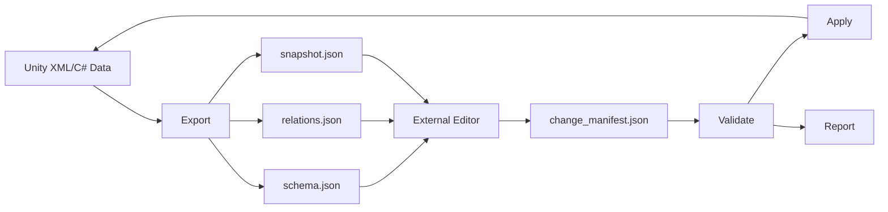

# DIET Unity Data Pipeline Sample

Unity 내부 XML/C# 데이터를 외부 편집 가능한 `schema`, `relations`, `snapshot`으로 export하고, 외부 변경 요청을 validate 후 apply하는 데이터·에셋 파이프라인 샘플입니다.

원본 프로젝트 코드는 포함하지 않으며, 채용 검토자가 문제 인식과 구조 설계 방식을 확인할 수 있도록 핵심 흐름만 공개용으로 정리했습니다.

## 보여주려는 역량

- Unity Editor Tool 설계
- 데이터 계약 export
- 외부 변경 요청 validate
- stale snapshot 방지
- 검증 통과 변경만 apply
- 기존 XML 런타임 로딩 경로와 새 편집 워크플로우의 호환

## 전체 흐름

## 핵심 설계 판단

### 1. 외부 변경은 바로 적용하지 않는다

외부 편집 결과는 `change_manifest`로 들어오지만, Unity 프로젝트에는 곧바로 반영하지 않습니다. 먼저 validate 단계에서 현재 snapshot과 base snapshot을 비교하고, 적용 가능한 변경만 report로 남깁니다.

### 2. 오래된 snapshot 기준 변경을 거절한다

작업자가 오래된 데이터 기준으로 수정한 내용을 최신 Unity 데이터 위에 덮어쓰면 손상이 생길 수 있습니다. 이를 막기 위해 `baseSnapshotHash`와 현재 snapshot hash를 비교합니다.

### 3. 기존 런타임 로딩 경로를 존중한다

새 편집 구조를 도입하더라도 기존 XmlSerializer 런타임 경로를 무리하게 갈아엎지 않습니다. 필요한 경우 DIET 편집용 XML과 legacy XML 사이에 adapter를 둡니다.

## Sample Files

- [`DesignerDataPipelineSample.cs`](DesignerDataPipelineSample.cs)
- [`DietChangeValidatorSample.cs`](DietChangeValidatorSample.cs)
- [`diet_snapshot.example.json`](diet_snapshot.example.json)
- [`change_manifest.example.json`](change_manifest.example.json)

## 검증 케이스

| 케이스 | 기대 결과 |
|---|---|
| 최신 snapshot 기준 변경 | validate 통과 |
| 오래된 snapshot 기준 변경 | stale snapshot으로 reject |
| 허용되지 않은 필드 변경 | reject |
| 존재하지 않는 row 수정 | reject |
| dry-run validate | 원본 데이터 변경 없음 |
| apply 실행 | 검증 통과 변경만 반영 |

## 공개 범위

이 문서는 포트폴리오 공개용 구조 샘플입니다. 내부 데이터, 원본 XML, 실제 에셋 경로, 팀 리소스는 포함하지 않습니다.
