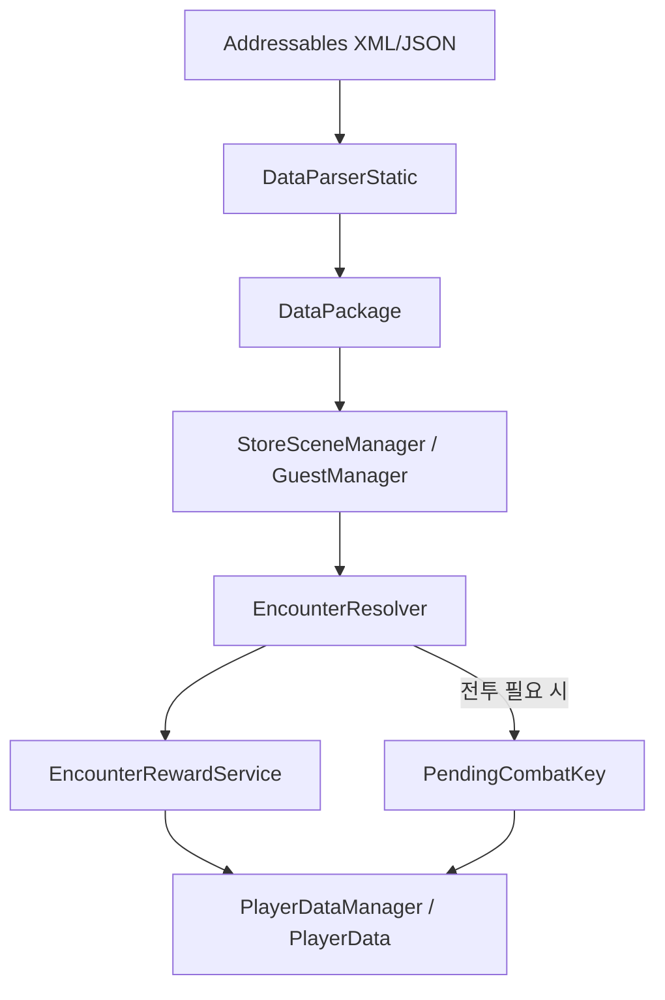

# Izakoza Gameplay System Samples

상용 예정 Unity/Spine 기반 로그라이트 덱빌딩 프로젝트에서 담당한 세이브/로드, 상점·인벤토리, 인카운터·보상, 전투 진입 연결부를 공개 가능한 형태로 축약한 샘플입니다.

원본 상용 프로젝트 코드는 포함하지 않으며, 채용 검토자가 구조와 코드 스타일을 확인할 수 있도록 핵심 흐름만 재구성했습니다.

## 보여주려는 역량

- PlayerData 기반 진행 상태 저장
- 정적 기획 데이터와 런타임 저장 데이터의 책임 분리
- 상점 구매 검증, 결제, 지급, UI 갱신, 저장 확정 흐름
- 저장 실패 시 snapshot rollback
- 인카운터 완료 기록과 보상 중복 방지
- 전투 진입 전 pending combat 정보 저장

## 시스템 흐름

## 핵심 설계 판단

### 1. 저장은 기능이 아니라 안정성 계층으로 본다

상점 구매, 전투 결과, 보상 지급은 모두 플레이어 진행 상태를 바꿉니다. 따라서 단순히 값을 변경하고 JSON을 저장하는 방식이 아니라, 변경 전 스냅샷을 만들고 저장 성공 후에만 결과를 확정하는 흐름으로 설계했습니다.

### 2. 정적 데이터와 저장 데이터는 분리한다

XML/JSON 기획 데이터는 Addressables를 통해 로드하고, 플레이어 진행 상태는 PlayerData JSON으로 따로 저장합니다. 게임 로직은 정적 데이터 테이블을 조회하되, 현재 진행 상황은 PlayerData만 기준으로 판단합니다.

### 3. 보상과 완료 기록은 같은 확정 흐름 안에 둔다

보상만 지급되고 완료 기록이 저장되지 않거나, 완료 기록만 남고 보상이 지급되지 않는 상태를 줄이기 위해 보상 처리와 완료 기록 저장을 같은 transaction 관점에서 다룹니다.

## Sample Files

- [`PlayerDataTransactionSample.cs`](PlayerDataTransactionSample.cs)
- [`ShopPurchaseFlowSample.cs`](ShopPurchaseFlowSample.cs)
- [`EncounterRewardFlowSample.cs`](EncounterRewardFlowSample.cs)

## 검증 케이스

| 케이스 | 기대 결과 |
|---|---|
| 정상 저장 | PlayerData가 갱신되고 이어하기 가능 |
| 저장 실패 | 변경 전 snapshot으로 rollback |
| 구매 중 결제 실패 | 지급 없이 구매 실패 반환 |
| 구매 아이템 지급 실패 | 결제 차감 상태도 rollback |
| 보상 저장 실패 | 보상과 완료 기록 모두 미확정 처리 |
| 전투 진입 직전 종료 | PendingCombatKey 기준으로 전투 진입 여부 복원 |

## 공개 범위

이 문서는 포트폴리오 공개용 구조 샘플입니다. 상용 프로젝트 원본 코드, 에셋, 기획 데이터, 내부 파일 경로는 포함하지 않습니다.
