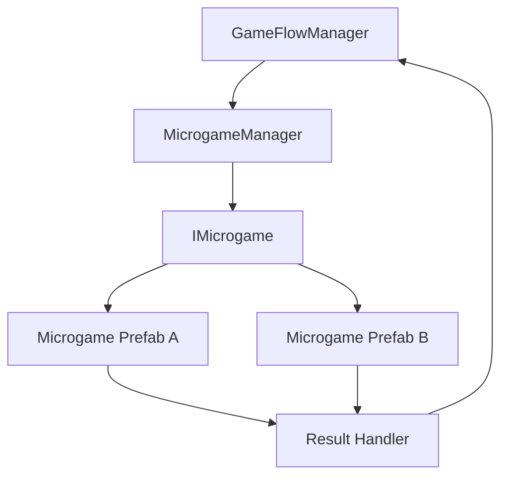

# Pansori Microgame Framework Sample

40시간 게임잼 우승 프로젝트에서 사용한 미니게임 통합 구조를 공개용으로 정리한 샘플입니다.

원본 프로젝트 전체 코드는 포함하지 않고, 9개 미니게임과 연습 모드를 하나의 플레이 흐름으로 묶기 위해 사용한 구조적 판단을 중심으로 정리했습니다.

## 보여주려는 역량

- 제한 시간 안에서 통합 가능한 구조를 먼저 세우는 판단
- Prefab 기반 미니게임 실행 흐름
- 공통 인터페이스 기반 시작 / 종료 / 결과 보고
- 개별 미니게임과 전체 진행 흐름의 책임 분리
- 신규 미니게임 생성용 Unity Editor Tool 설계

## 구조

## 핵심 설계 판단

### 1. 개별 씬이 아니라 Prefab 단위로 실행한다

게임잼에서는 씬 전환보다 통합 실패가 더 큰 리스크였습니다. 각 미니게임을 Prefab으로 만들고, 공통 manager가 생성 / 시작 / 종료 / 제거를 담당하게 하여 통합 비용을 줄였습니다.

### 2. 미니게임은 성공/실패만 보고한다

개별 미니게임은 자기 규칙에 집중하고, 점수 반영, 사운드, 다음 게임 전환은 상위 flow가 담당합니다.

### 3. 새 미니게임 추가 기준을 템플릿화한다

폴더 구조, manager script, 기본 lifecycle을 자동 생성해 팀원이 같은 형식으로 기능을 붙일 수 있게 했습니다.

## Sample Files

- [`MicrogameLifecycleSample.cs`](MicrogameLifecycleSample.cs)
- [`MicrogameTemplateCreatorSample.cs`](MicrogameTemplateCreatorSample.cs)

## 검증 케이스

| 케이스 | 기대 결과 |
|---|---|
| 미니게임 시작 | 난이도와 속도가 같은 방식으로 전달 |
| 결과 중복 보고 | 첫 결과만 유효 처리 |
| 프리팹 누락 | 시작 전 validation에서 실패 |
| 연습 모드 실행 | 본 게임 진행 상태를 변경하지 않음 |
| 신규 미니게임 생성 | 폴더와 기본 manager script 생성 |

## 공개 범위

이 문서는 포트폴리오 공개용 구조 샘플입니다. 원본 게임잼 프로젝트의 에셋, 팀 리소스, 전체 구현은 포함하지 않습니다.
